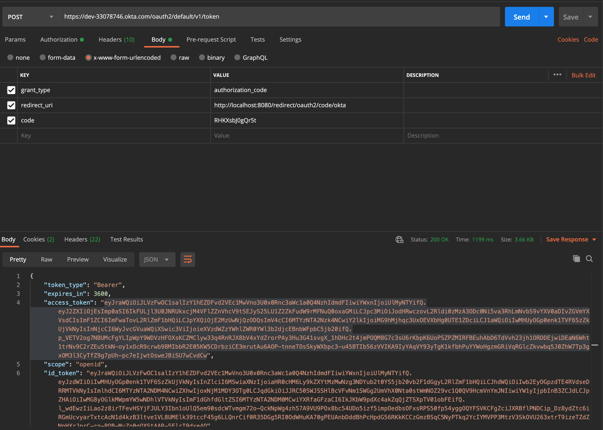

# Getting Started

This is a sample okta application. The application gets the authorisation code using the URL below. 

https://dev-33078746.okta.com/oauth2/default/v1/authorize?client_id=0oa28jsu18EWlx4Q15d7&response_type=code&scope=openid&redirect_uri=http://localhost:8080/redirect/oauth2/code/okta&state=state-296bc9a0-a2a2-4a57-be1a-d0e2fd9bb601

* client_id is the client id of the application created on Okta
* response_type should be set to code since we want the authorization code
* scope should be set to openid
* redirect_uri is the login redirect url. This is the url user will be redirected to once login has been successful on the okta login page. The redirect login url expects an authorization code
* state is a random alphanumeric string

Once the redirect URL receives the code, the code can then be used to get access token. Resources (endpoints) will be protected with Okta and anyone that needs to access this must have gotten a valid bearer token.

Below endpoint can be used to get bearer token

https://dev-33078746.okta.com/oauth2/default/v1/token (POST)

Then the token can be used to access protected resources